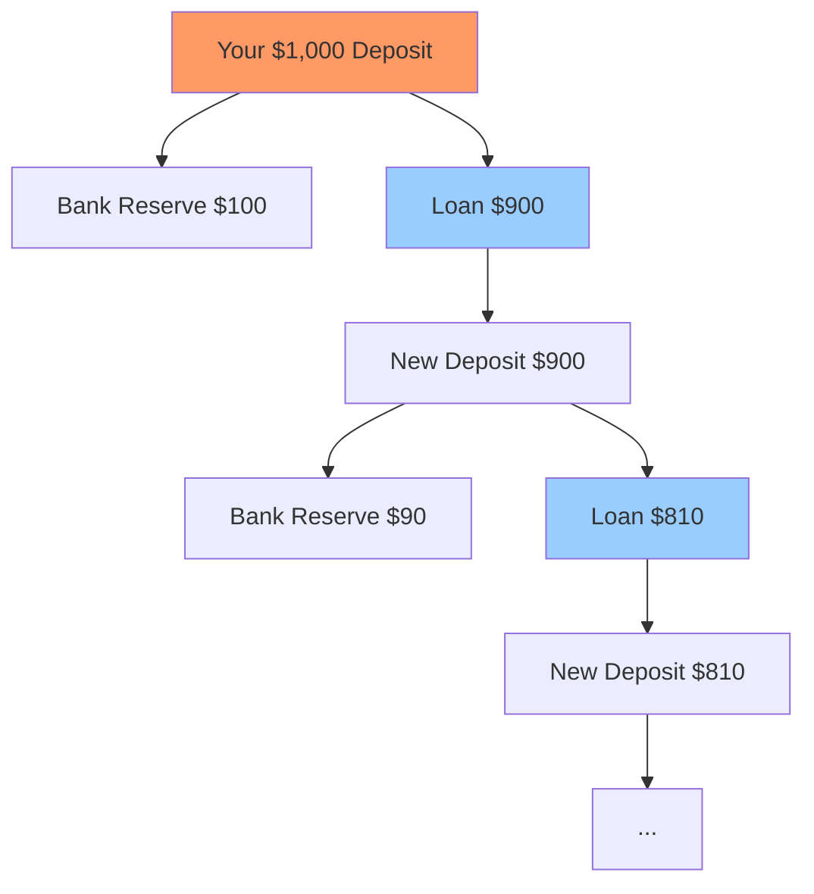
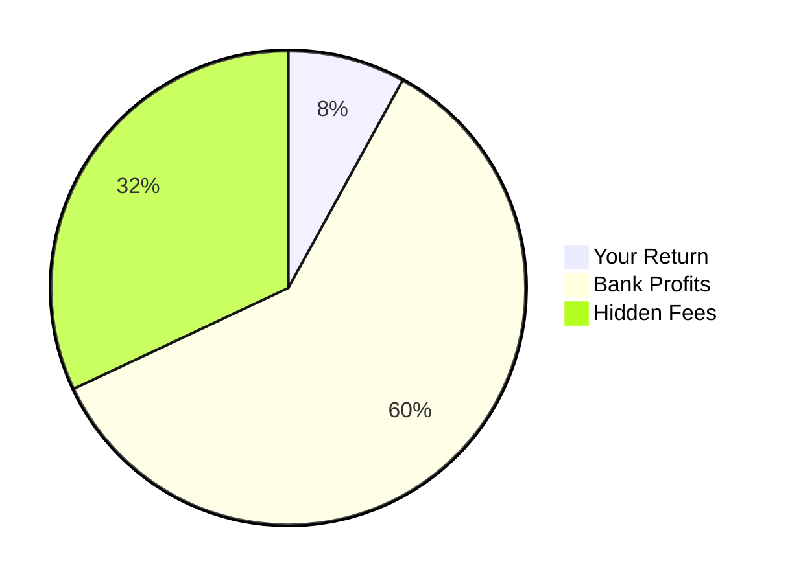
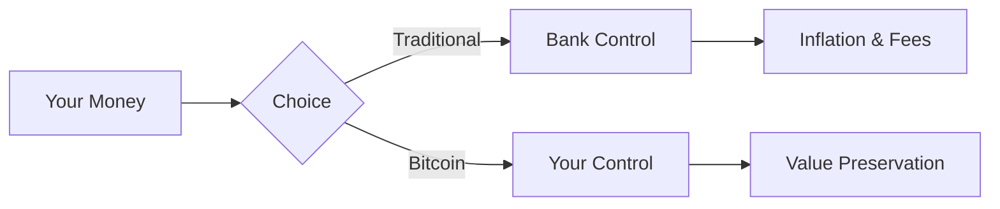

# Bitcoin: The Solution
## Breaking Free from the Fractional Reserve Prison

  
    Press Space for next page <carbon:arrow-right class="inline"/>
  

---
layout: image-right
image: https://images.unsplash.com/photo-1633158829585-23ba8f7c8caf?ixlib=rb-4.0.3
---

# The Problem

Your money isn't really yours.

<v-clicks>

- Banks only keep a fraction of your deposits
- They create money out of thin air
- Your savings lose value through inflation
- You have no control over your wealth
- The system is designed to benefit the few

</v-clicks>

---
layout: two-cols
---

# Fractional Reserve Banking

How banks multiply your money without your permission

<v-clicks>

- You deposit $1,000
- Bank keeps only $100 (10%)
- Lends out $900
- That $900 gets redeposited
- Process repeats...
- Your $1,000 becomes $10,000 in the system

</v-clicks>

::right::

---
layout: center
class: text-center
---

# The Real Cost

## Inflation
Your money loses value every year

<Counter :count="100" />

Your $100 purchasing power over time

## Bank Profits
While they play with your money

---
layout: image-left
image: https://images.unsplash.com/photo-1621761191319-c6fb62004040?ixlib=rb-4.0.3
---

# Enter Bitcoin

The first truly sound money

<v-clicks>

- Fixed supply: Only 21 million ever
- No central authority
- Can't be inflated away
- You hold your own keys
- Transparent and verifiable
- Borderless and permissionless

</v-clicks>

<!--
- How many Millionaires are there?
- What happens if there is one server with all your data in it and it goes down?
- calculator analogy and on changing 1+1 = 2.
-
-->

---

# How Bitcoin Fixes This

## Traditional Banking
- Centralized control
- Infinite money printing
- Your money, their rules
- Hidden fees and restrictions
- Requires trust in institutions

## Bitcoin
- Decentralized network
- Fixed supply
- Your keys, your coins
- Transparent fees
- Trust in math, not humans

---
layout: center
---

# The Path Forward

## Learn
- Understand money
- Study Bitcoin
- Join communities
- Stay informed

## Start Small
- Get a wallet
- Buy some Bitcoin
- Make a transaction
- Experience freedom

## Take Control
- Be your own bank
- Protect your wealth
- Support the network
- Shape the future

---
layout: center
class: text-center
---

# Questions?

Let's discuss how we can break free from the traditional banking system

  
    Your financial freedom starts here
  

  <a href="https://bitcoin.org" target="_blank" alt="Bitcoin"
    class="text-xl icon-btn opacity-50 !border-none !hover:text-white">
    <carbon:currency-dollar />
  </a>

